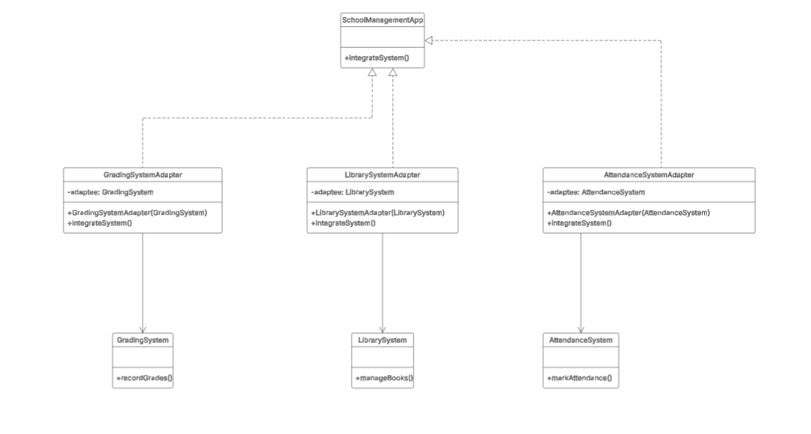

# Integrating Different School Systems into a Unified School Management Application

You are developing a school management application that helps administrators manage various school systems such as attendance, grading, and library management.  
Each system has different interfaces and methods.  
To ensure compatibility and seamless integration, you need to create adapters for different systems to allow them to connect to the unified school management application.

## UML Class Diagram

## 🧩 Adaptee Objects

- **AttendanceSystem** – Represents an attendance tracking system that needs to be integrated.  
  It has the `markAttendance()` method.

- **GradingSystem** – Represents a grading system that requires integration.  
  It has the `recordGrades()` method.

- **LibrarySystem** – Represents a library management system that needs to be integrated.  
  It has the `manageBooks()` method.

## ⚙️ Target Object

- **SchoolManagementApp** – Represents a unified school management application with a common interface for integrating systems.  
  It defines the `integrateSystem()` method as the target method.

## 🔌 Adapter Objects

- **AttendanceSystemAdapter** – An adapter for integrating the attendance system into the school management application.  
  It adapts the `AttendanceSystem` to the `SchoolManagementApp` interface, translating `integrateSystem()` to `markAttendance()`.

- **GradingSystemAdapter** – An adapter for integrating the grading system into the school management application.  
  It adapts the `GradingSystem` to the `SchoolManagementApp` interface, translating `integrateSystem()` to `recordGrades()`.

- **LibrarySystemAdapter** – An adapter for integrating the library management system into the school management application.  
  It adapts the `LibrarySystem` to the `SchoolManagementApp` interface, translating `integrateSystem()` to `manageBooks()`.
